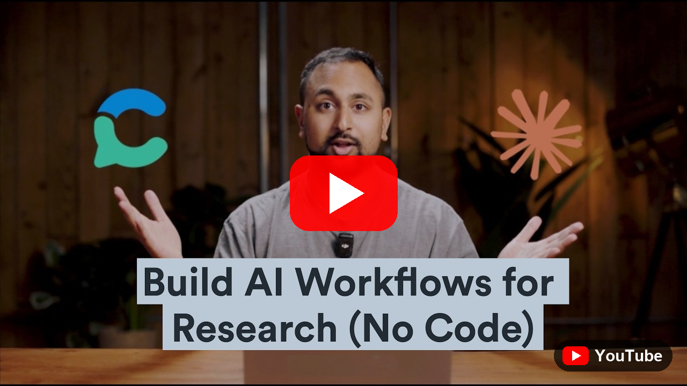

<a href="https://consensus.app"></a>

# Consensus MCP Server

[](https://consensus.app)
[](https://docs.consensus.app/docs/mcp)
[](https://modelcontextprotocol.io)
[](https://x.com/ConsensusNLP)

The Consensus MCP server connects AI assistants to [Consensus](https://consensus.app), the academic search engine. Claude, ChatGPT, Cursor, and any MCP-compatible client can search 220M+ peer-reviewed research papers and ground answers in real, citable studies, directly from the conversation.

**Server URL**

```
https://mcp.consensus.app/mcp
```

## Why Consensus

- **220M+ papers** across medicine, biology, psychology, computer science, economics, and every major field
- **Licensed full text**: partnerships with leading academic publishers let answers draw on paywalled research you can't get anywhere else
- **Powered by Scholar Agent**: the Consensus agentic search harness built specifically for research and science. It plans searches, applies quality filters, and weighs evidence the way a trained researcher would
- **Search built for research questions**: results are ranked for relevance to the question, not keyword overlap
- **Rich metadata on every paper**: citation counts, study type, sample size, journal quality (SJR quartile), and a key takeaway
- **Quality filters**: restrict results to RCTs, meta-analyses, human studies, minimum sample sizes, top-quartile journals, and more

## Get started

[](https://www.youtube.com/watch?v=gcMel2guYE8&t=4s)

### Claude (web and desktop)

One click: open [Consensus in the Claude directory](https://claude.ai/directory/65247229-f0c7-49df-9044-fcbb8b3894c6) and click **Connect**. Or manually:

1. Open [claude.ai](https://claude.ai) (or the Claude desktop app) and go to **Settings**
2. Select **Connectors**, then **Browse connectors**
3. Search for **Consensus** and click **Connect**
4. Approve the sign-in with your Consensus account (or continue without one at reduced limits)
5. Ask a research question in any chat; Consensus appears in the tools menu

### ChatGPT

One click: open [Consensus in the ChatGPT plugin directory](https://chatgpt.com/plugins/plugin_asdk_app_6943e6f4a928819195962de16fb9ffe4) and click **Connect**. Or manually:

1. Open [chatgpt.com](https://chatgpt.com) and sign in
2. Open **Plugins** from the sidebar
3. Search for **Consensus** and click **Connect**
4. Sign in with your Consensus account when prompted
5. Ask a research question, or call it by name: "Use Consensus to find RCTs on..."

### Claude Code

```bash
claude mcp add --transport http consensus https://mcp.consensus.app/mcp
```

### Codex

```bash
codex mcp add consensus --url https://mcp.consensus.app/mcp
codex mcp login consensus
```

Or add to `~/.codex/config.toml`:

```toml
[mcp_servers.consensus]
url = "https://mcp.consensus.app/mcp"
```

### Cursor

[](https://cursor.com/en/install-mcp?name=consensus&config=eyJ1cmwiOiJodHRwczovL21jcC5jb25zZW5zdXMuYXBwL21jcCJ9)

Or add to `~/.cursor/mcp.json`:

```json
{
  "mcpServers": {
    "consensus": {
      "command": "npx",
      "args": ["-y", "mcp-remote@latest", "https://mcp.consensus.app/mcp"]
    }
  }
}
```

### VS Code (GitHub Copilot)

Add to your MCP configuration:

```json
{
  "servers": {
    "consensus": {
      "url": "https://mcp.consensus.app/mcp"
    }
  }
}
```

### Windsurf

```json
{
  "mcpServers": {
    "consensus": {
      "serverUrl": "https://mcp.consensus.app/mcp"
    }
  }
}
```

### Everything else

Any client that supports remote MCP servers (Streamable HTTP) works. Point it at:

```
https://mcp.consensus.app/mcp
```

## The `search` tool

Search 220M+ academic papers. Returns ranked results with title, authors, journal, publication year, DOI, citation count, study type, a key takeaway, and a link to the paper on Consensus.

Optional filters: publication year and month, study design (RCT, meta-analysis, systematic review, and more), human studies, controlled studies, minimum sample size, journal quality (SJR quartile), minimum citations, open access, clinical guidelines, academic field, and country.

## Things to ask

| Ask | Try it |
|-----|--------|
| "What does the research say about creatine and cognitive function?" | [ChatGPT](https://chatgpt.com/?q=What%20does%20the%20research%20say%20about%20creatine%20and%20cognitive%20function%3F) · [Claude](https://claude.ai/new?q=What%20does%20the%20research%20say%20about%20creatine%20and%20cognitive%20function%3F) |
| "Find meta-analyses on mindfulness for anxiety published since 2020" | [ChatGPT](https://chatgpt.com/?q=Find%20meta-analyses%20on%20mindfulness%20for%20anxiety%20published%20since%202020) · [Claude](https://claude.ai/new?q=Find%20meta-analyses%20on%20mindfulness%20for%20anxiety%20published%20since%202020) |
| "Are there RCTs on intermittent fasting with more than 500 participants?" | [ChatGPT](https://chatgpt.com/?q=Are%20there%20RCTs%20on%20intermittent%20fasting%20with%20more%20than%20500%20participants%3F) · [Claude](https://claude.ai/new?q=Are%20there%20RCTs%20on%20intermittent%20fasting%20with%20more%20than%20500%20participants%3F) |
| "What is the strongest evidence for and against remote work productivity?" | [ChatGPT](https://chatgpt.com/?q=What%20is%20the%20strongest%20evidence%20for%20and%20against%20remote%20work%20productivity%3F) · [Claude](https://claude.ai/new?q=What%20is%20the%20strongest%20evidence%20for%20and%20against%20remote%20work%20productivity%3F) |

## Authentication

Most clients use OAuth: you sign in with your Consensus account the first time you connect. Claude and ChatGPT also work without an account at reduced limits. Paper counts and monthly search limits vary by plan: see [consensus.app/pricing](https://consensus.app/pricing/). Enterprise customers authenticate with an API key as a Bearer token:

```
Authorization: Bearer YOUR_API_KEY
```

## For enterprises

Consensus powers research for organizations ranging from universities and research institutions to biotechs and manufacturers. Our team partners with you to bring evidence-grounded search to your users and your internal teams alike: member-facing products, research workflows, internal copilots, custom rate limits, and hands-on integration support.

- Read how [Owkin uses the Consensus MCP](https://consensus.app/home/community-voices/owkin/)
- See a worked example: [Building a Research Opportunity Engine](https://consensus.app/home/resources/building-a-research-opportunity-engine-copy/)

[](https://consensus.app/home/api/)

## Consensus API

Building an application instead of connecting a chat client? The same search is available as a REST API at `api.consensus.app/v1/search`. See the [consensus-api](https://github.com/Consensus-NLP/consensus-api) repo, the [API reference](https://docs.consensus.app/reference/v1_search), and [API access](https://consensus.app/home/api/).

## About this repo

The Consensus MCP server is a hosted remote server; there is nothing to install from source. This repo is its public home: setup guides, announcements, and [issues](../../issues). Full documentation lives at [docs.consensus.app/docs/mcp](https://docs.consensus.app/docs/mcp).

---

Made by [Consensus](https://consensus.app), the AI search engine for research. Follow us on [X](https://x.com/ConsensusNLP) and [LinkedIn](https://www.linkedin.com/company/consensus-nlp).
